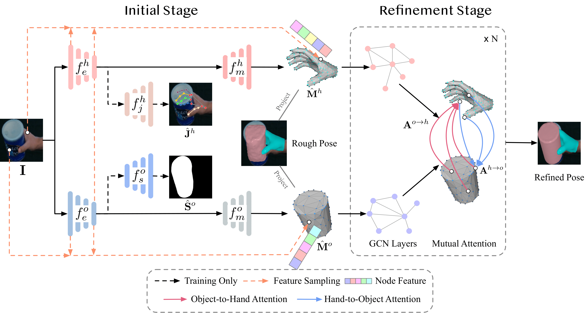

<br />
<p align="center">
    <h1 align="center">
        Interacting Hand-Object Pose Estimation via Dense Mutual Attention
    </h1>

  <p align="center">
    
  </p>
  <p align="center">
    <strong>WACV, 2023</strong>
    <br />
    <a href="https://github.com/rongakowang"><strong>Rong Wang </strong></a>
    .
    <a href="https://github.com/wei-mao-2019"><strong>Wei Mao</strong></a>
    ·
    <a href="http://users.cecs.anu.edu.au/~hongdong/"><strong>Hongdong Li</strong></a>
  </p>
  
  <p align="center">
    <a href='https://openaccess.thecvf.com/content/WACV2023/html/Wang_Interacting_Hand-Object_Pose_Estimation_via_Dense_Mutual_Attention_WACV_2023_paper.html'>
      
    </a>
    <a href='https://arxiv.org/abs/2211.08805' style='padding-left: 0.5rem;'>
      
    </a>
    <a href='https://www.youtube.com/watch?v=dQfK8nb-0i8' style='padding-left: 0.5rem;'>
      
    </a>
  </p>
</p>

<br />

## Installation

### Environment

Retrive the repo first, for the rest sections, we assume the `ROOT_DIR` is at `DenseMutualAttention`:

```
git clone --recursive https://github.com/rongakowang/DenseMutualAttention.git
```

Create a conda venv and install `pytorch`:

```
conda env create -n DMA python=3.8
conda activate DMA
conda install pytorch==1.7.0 torchvision==0.8.0 torchaudio==0.7.0 cudatoolkit=11.0 -c pytorch
```

Install base dependencies:

```
pip install -r requirements.txt
```

Install `torch-sparse` and `torch-scatter` seperately, as they need to strictly match the CUDA version:

```
pip install torch-sparse==0.6.8 torch-scatter=2.0.5 -f https://data.pyg.org/whl/torch-1.7.0+cu110.html
```

Install `dex-ycb-toolkit`:

```
cd cd data/DexYCB/dex-ycb-toolkit
pip install -e .
```

The above commands are tested in `Ubuntu 20.04`.

### Datasets

Download HO3D [**v2**](https://arxiv.org/abs/1907.01481.pdf) from the [official site](https://github.com/shreyashampali/ho3d) and [DexYCB](https://arxiv.org/abs/2104.04631) dataset from the [official site](https://dex-ycb.github.io). Then unzip the datasets to `./local_data` and rename them as `ho3d` and `dex-ycb` respectively.  

Download the [MANO](https://mano.is.tue.mpg.de/download.php) hand model and extract the `pkl` files under `./local_data/mano`.

Finally, download the [additional data](https://drive.google.com/drive/folders/1dTtIcxdg468jmv-MrsDZbNmlOoANoqBS?usp=share_link) and extract them under `local_data`. The data contains:

- Simplified mesh data for the YCB objects, under `local_data/ho3d_simple` and `local_data/dex_simple`.
- Preprocessing meta data for the DexYCB dataset, under `local_data/dex-ycb/meta`.

The `./local_data` folder should have structure like:

```
    ├── ho3d
    │   ├── evaluation
    │   ├── evaluation.txt
    │   ├── train
    │   └── train.txt
    ├── dex-ycb
    │   ├── 20200709-subject-01
    │   ├── 20200813-subject-02
    │   ├── 20200820-subject-03
    │   ├── 20200903-subject-04
    │   ├── 20200908-subject-05
    │   ├── 20200918-subject-06
    │   ├── 20200928-subject-07
    │   ├── 20201002-subject-08
    │   ├── 20201015-subject-09
    │   ├── 20201022-subject-10
    │   ├── bop
    │   ├── calibration
    │   └── models
    │   └── meta
    ├── mano
    │   ├── MANO_LEFT.pkl
    │   ├── MANO_RIGHT.pkl
    ├── ho3d_simple
    ├── dex_simple
```

## Evaluation

### HO3Dv2

Download the pretrained [model](https://drive.google.com/file/d/1THFHRjAGDbOs4dcsM7khScL7lwpw6Uf8/view?usp=share_link) and run the below command to obtain the result in Table 1 in the paper, note that the FPS may vary on devices.

```sh
cd main
python test.py --gpu 0 --model_path '../pretrained_weights/snapshot_ho3d.pth.tar'
```

### DexYCB

Download the pretrained [model](https://drive.google.com/file/d/1Uyu_RDjIjvc3SjsqaTowSnP2__aXYwTb/view?usp=share_link) and run the below command to obtain the result in Table 2 in the paper.
```sh
cd main
python test_dexycb.py --gpu 0 --model_path '../pretrained_weights/snapshot_dexycb.pth.tar'
```

## Citation

If you use the code for your research, please cite with the below:
```
@InProceedings{Wang_2023_WACV,
    author    = {Wang, Rong and Mao, Wei and Li, Hongdong},
    title     = {Interacting Hand-Object Pose Estimation via Dense Mutual Attention},
    booktitle = {Proceedings of the IEEE/CVF Winter Conference on Applications of Computer Vision (WACV)},
    month     = {January},
    year      = {2023},
    pages     = {5735-5745}
}
```

## Acknowledge

The codebase is adopted from the repo [handAR](https://github.com/wbstx/handAR) and [homan](https://github.com/hassony2/homan), please also check out and cite them if you find them useful.
